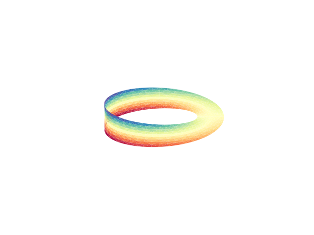
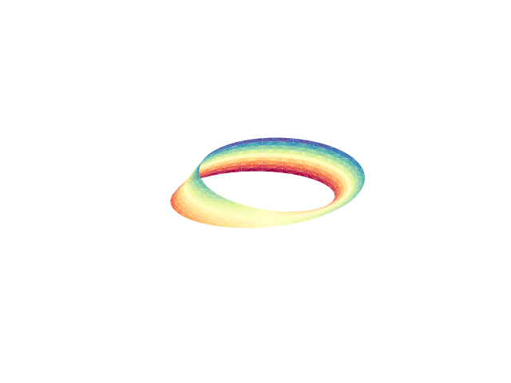
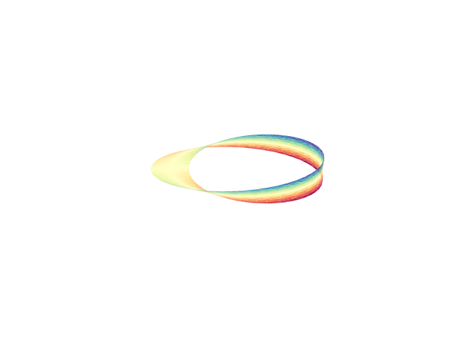
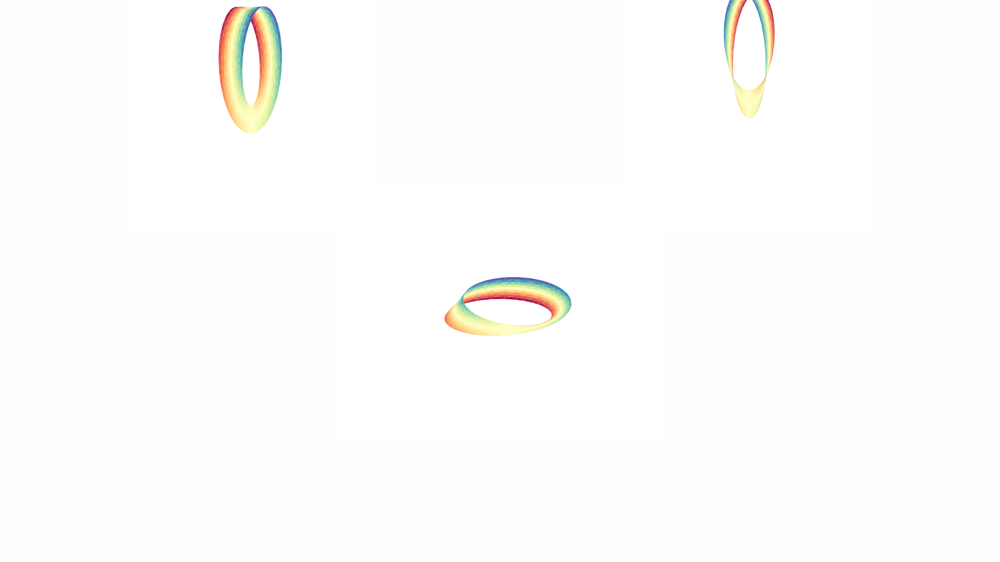
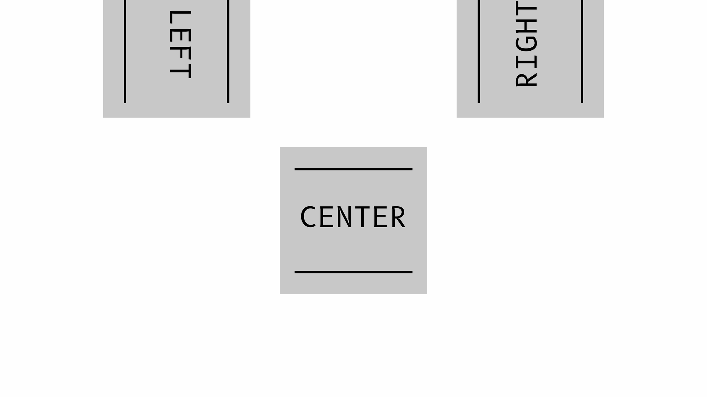

# Dreamoc image stitcher

This utility facilitates stitching three images together (the intention is
these will be the left, center and right-side view of a scene) together to form
a single image to be shown on the Dreamoc.

## Installation and usage

Install requirements with pip

> pip install -r requirements.txt

Run

> python stitch.py img_L.png img_C.png img_R.png

## Examples

### Mobius strip

**input**

<table>
<tr>
<td></td>
<td></td>
<td></td>
</tr>
</table>

**output**

### Text strip

**input**

<table>
<tr>
<td></td>
<td></td>
<td></td>
</tr>
</table>

**output**

